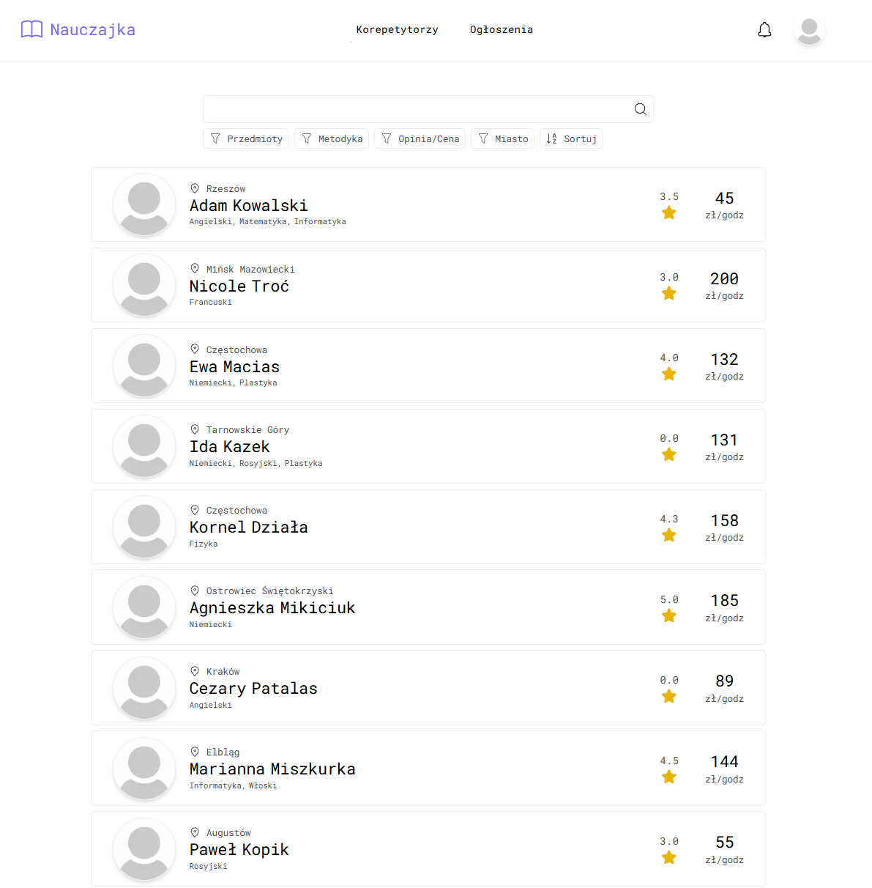
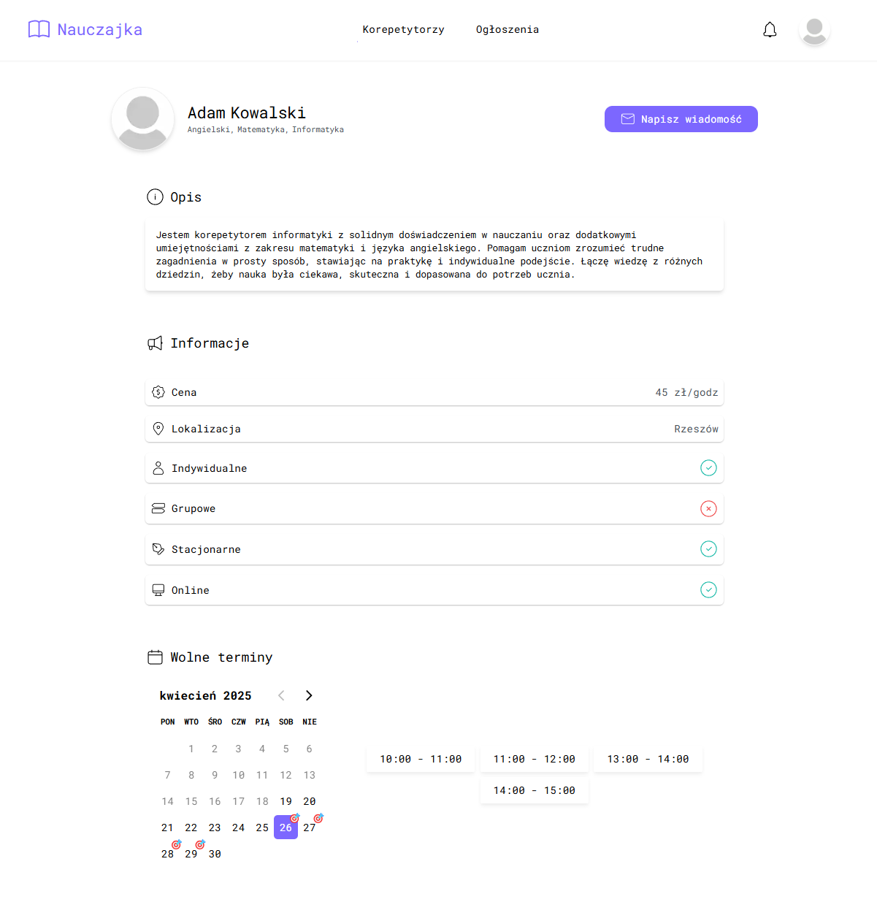
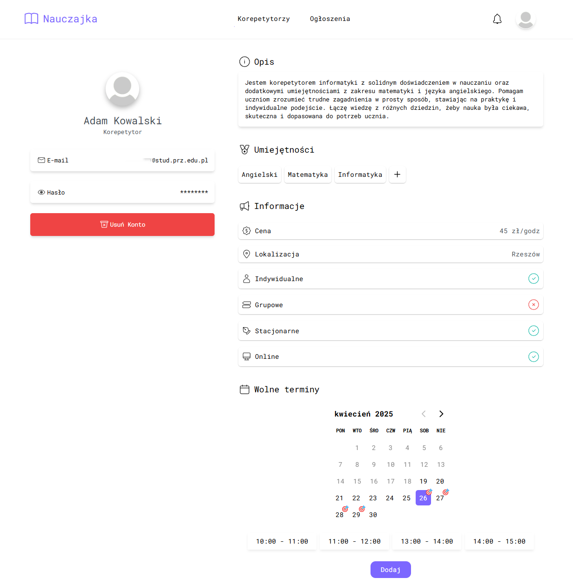
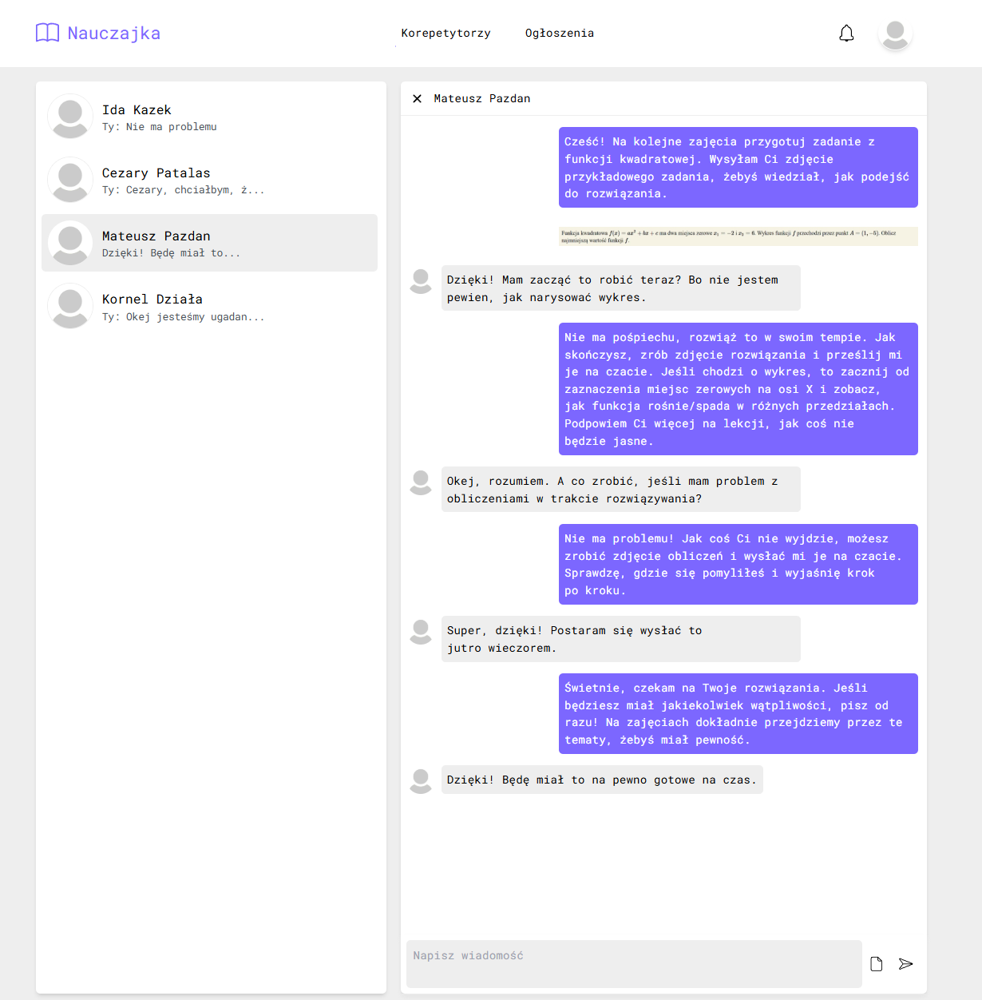
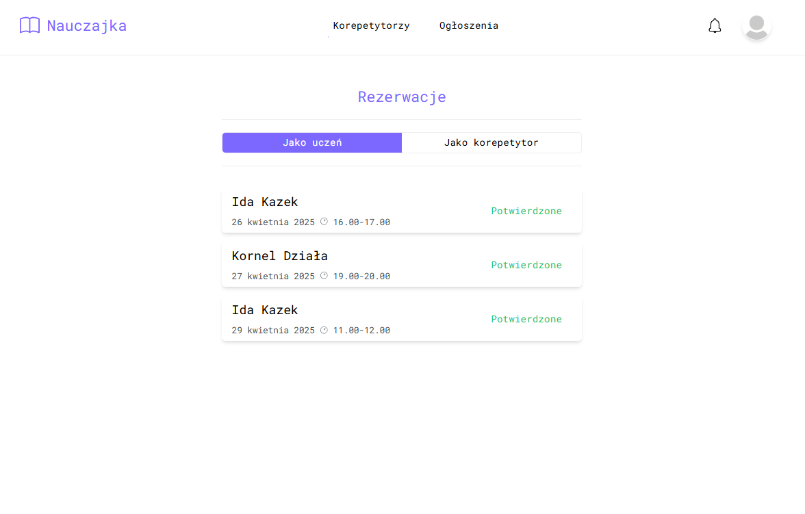
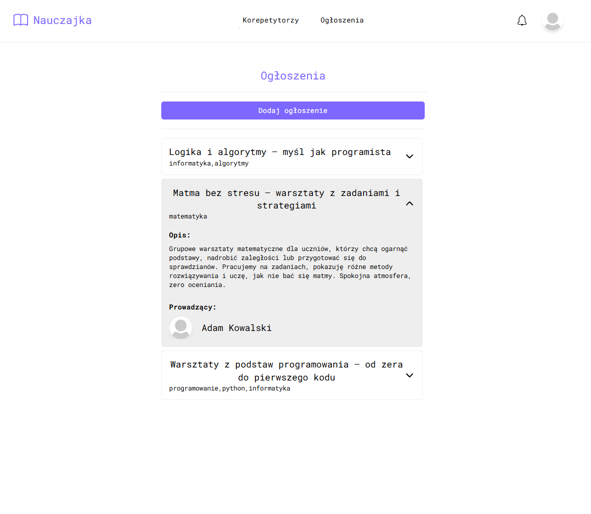
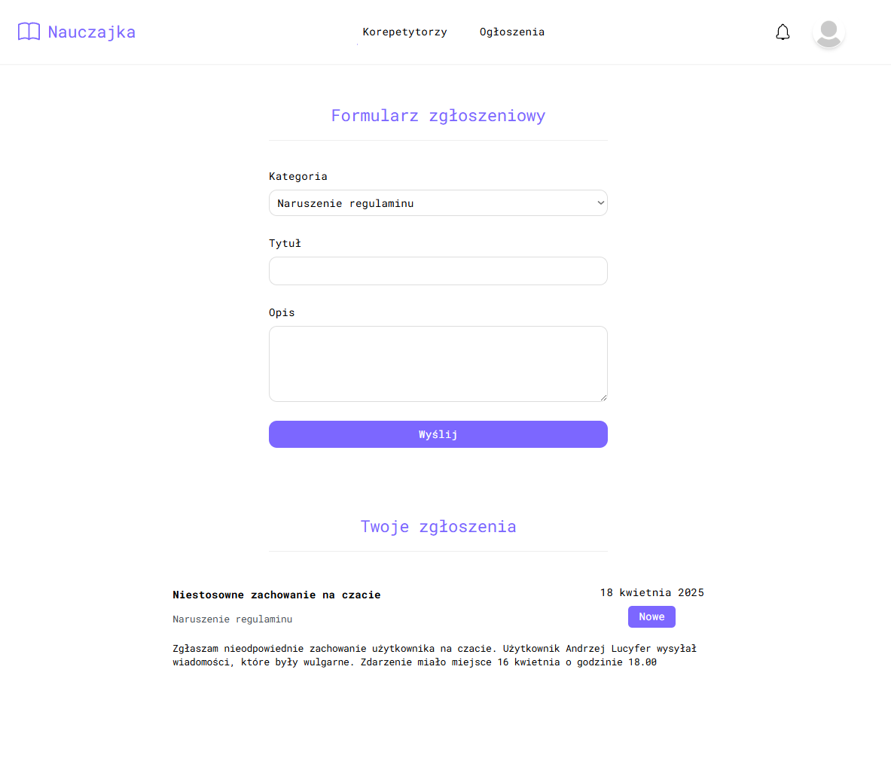

<p align="center">
  
</p>

#  Nauczajka

Nauczajka – a responsive web application connecting tutors with students. It enables account creation, tutor search, rating, in-app chat communication, and full profile and lesson offer management.


## Table of contents

- Description
- Features
- Requirements
- Installation
- Launching
- Screenshots of the App


## 📝 Description

Nauczajka is a web application that connects tutors with students, offering a complete system for managing tutoring services online. Users can register either as students or tutors, and depending on their role, gain access to different features.

Students can search for tutors using advanced filters such as subject, teaching method, location, rating, and price. They can view detailed tutor profiles, including availability, teaching style, and subjects offered. Once they find a match, students can contact tutors through a built-in chat system, book lessons, and leave reviews with a star rating and comments. Each student also has a personal profile with basic settings like profile photo, password management, and account deletion.

Tutors can fully manage their public profiles by editing descriptions, updating skills, adding subjects, and setting available time slots. They can communicate with students via chat and receive feedback through the rating system visible to other users.

Registration is required to interact with tutors, but the search engine is available to all users, even without logging in. This ensures that anyone can explore available tutoring offers quickly and efficiently.


## 🚀 Features

- ✅ User registration and login
- ✅ Create profile as Student or Tutor
- ✅ Browse tutors with filters
- ✅ Rating and review system
- ✅ Tutor profile pages with info and availability
- ✅ In-app chat for tutor communication
- ✅ Availability and profile management (for tutors)
- ✅ Report technical issues or abuse to admins
 


## 📦 Requirements

- Node.js >= 18  


## 🛠 Installation

1. Clone the repository
   ```bash
   git clone https://github.com/ProOnDesk/nauczajka-front.git

2. Go to folder
   ```bash
   cd nauczajka-front

3. Install dependencies
   ```bash
   npm install

## 🏃‍♂️ Launching

  ```bash
    npm run dev
  ```


## 📸 Screenshots of the App

### 🔍 Tutor Browser 
Browse the list of available tutors with key info and sorting options.


### 📘 Tutor Info Page
View detailed tutor profiles with availability, pricing, and reviews.


### ⚙️ User & Tutor Settings
Manage profile settings, update details, and customize your account.


### 💬 Chat
Communicate directly with tutors through the built-in chat system.


### 📅 Reservations
Book lessons based on tutor availability.


### 📢 Announcements
See tutor announcements about group classes, workshops, or extra sessions.


### Report Issue
Report technical issues or inappropriate behavior to administrators.



 


